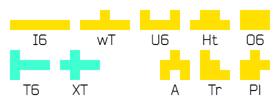

# Hexamino_Naming
我自己的六连块命名 My hexamino names

## 轴对称系 Axisymmetric

对称方块共有十个。

There are 10 axisymmetric hexaminoes.

- I6 , T6 , O6 , U6

仿照四连、五连方块取的名字。

Names are from tetrominoes and pentominoes.

- wT (wide-T)

由T块加宽得到。

A "wide" T-piece.

- Ht (Hat)

形似帽子而得名。

Shapes like a hat.

- XT

形似五连块的 X，但多出一格，像小写的 t，故名。

Similar to X-pentomino, but shapes like a lowercase letter t because of the extra cell.

- A

唯一一个单字母命名。形似大写字母 A。

The only 1-letter name. Shapes like the uppercase letter A.

- Tr (Triangle)

三角形。

Triangle.

- Pl (Plum) / Gp (Grape)

围棋有一术语称“梅花六”或“葡萄六”，描述的正是这种形状（不过是被围出来的区域），故借用之。

There is a term in Go chess called "Plum Six" or "Grape Six", which describes this shape (but it is the enclosed area), so it is borrowed to name this shape.

## 非轴对称系 Non-axisymmetric

不对称方块共有 50 个，25 对。

There are 50 non-axisymmetric hexaminoes (25 pairs of axisymmetric hexaminoes).

### 2×5

- J6 & L6 , R6 & Y6 , N6 & H6

仿照四连、五连方块取的名字。

Names are from tetrominoes and pentominoes.

- wZ (wide-Z) & wS (wide-S)

由S/Z块加宽得到。

A "wide" S/Z-piece.

### 2×4

- P6 & Q6 , F6 & E6

仿照四连、五连方块取的名字。

Names are from tetrominoes and pentominoes.

- lSp (l-Spoon) & rSp (r-Spoon)

形似勺子而得名。

Shapes like a spoon.

- bZ (bold-Z) & bS (bold-S)

由 Z、S 块加粗得到。

A "bold" Z/S-tetromino.

### 3×3

- Zr (Z-rotate) & Sr (S-rotate)

可以视作 Z/S 块绕其旋转中心旋转 90° 得到的形状。

It can be thought of as the shape of a Z/S-piece rotated 90° around its rotation center.

- rHk (r-Hook) & lHk (l-Hook)

形似钩子而得名。

Shapes like a hook.

- n1 (number-1) & n4 (number-4)

形似数字1、数字4而得名。有一名为 Number One 的开局定式。

Shapes like a number 1/4. There is a n opener called "Number One".

- ZO & SO

Z/S 块与 O 块组合成的形状。对于六连块，组合出的形状唯一。

A combination of a Z/S-piece and a O-piece. For hexamino, this is the only shape they can be combined.

### 3×4