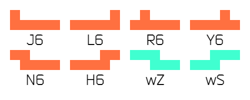

# Hexamino_Naming V0.1 by Aqua6623

六连块共有 60 种，其中 10 种是轴对称图形，若允许翻转则有 35 种。  
其中 20 种是正方体的[展开图](https://zh.wikipedia.org/wiki/%E5%B1%95%E9%96%8B%E5%9C%96)，若允许翻转则有 11 种。所有正方体展开图用碧绿色标出。

There are 60 different Hexaminoes, 10 of which are axisymmetric, so there are 35 if flip is allowed.  
20 (11 if flip is allowed) of them are [nets](https://en.wikipedia.org/wiki/Net_(polyhedron)) of a cube. All nets are marked in turquoise.

MultiMino 的作者，Axel Fox，也命名了所有六连块，但却拘泥于单个字符，使用了许多罕见符号。  
系统命名法虽适用所有六连块，但未免过于冗长且不够直观。  
故我又提出一套六连块命名，使用不超过 3 个拉丁字母且能直观表述所有形状，写于下方。  

Axel Fox, the author of MultiMino, also named all hexaminoes, but he stuck to naming with only one single character and used many uncommon symbols.  
Although a systematic nomenclature works for all hexaminoes, it is too long and not intuitive enough.  
So I came up with a set of six-block names that use no more than 3 Latin letters and can intuitively describe all shapes, written below.  

## 轴对称系 Axisymmetric

对称方块共有十个。

There are 10 axisymmetric hexaminoes.

- I6 , T6 , O6 , U6

仿照四连、五连方块取的名字。

Names are from tetrominoes and pentominoes.

- wT (wide-T)

由 T 块加宽得到。

A "wide" T-piece.

- Ht (Hat)

形似帽子而命名。

Shapes like a hat.

- XT

形似五连块的 X，但多出一格，像小写的 t，故名。

Similar to X-pentomino, but shapes like a lowercase letter t because of the extra cell.

- A

唯一一个单字母命名。形似大写字母 A。

The only 1-letter name. Shapes like the uppercase letter A.

- Tr (Triangle)

三角形。

Triangle.

- Pl (Plum) / Gp (Grape)

围棋有一术语称“梅花六”或“葡萄六”，描述的正是这种形状（不过是被围出来的区域），故借用之。

There is a term in Go chess called "Plum Six" or "Grape Six", which describes this shape (but it is the enclosed area), so it is borrowed to name this shape.

## 非轴对称系 Non-axisymmetric

不对称方块共有 50 种，25 对。

There are 50 non-axisymmetric hexaminoes (25 pairs of axisymmetric hexaminoes).

### 2×5

- J6 & L6 , R6 & Y6 , N6 & H6

仿照四连、五连方块取的名字。

Names are from tetrominoes and pentominoes.

- wZ (wide-Z) & wS (wide-S)

由 Z/S 块加宽得到。

A "wide" S/Z-piece.

### 2×4

- P6 & Q6 , F6 & E6

仿照四连、五连方块取的名字。

Names are from tetrominoes and pentominoes.

- lSp (l-Spoon) & rSp (r-Spoon)

形似勺子而命名。

Shapes like a spoon.

- bZ (bold-Z) & bS (bold-S)

由 Z/S 块加粗得到。

A "bold" Z/S-tetromino.

### 3×3

- Zr (Z-rotate) & Sr (S-rotate)

可以视作 Z/S 块绕其旋转中心旋转 90° 得到的形状。

It can be thought of as the shape of a Z/S-piece rotated 90° around its rotation center.

- rHk (r-Hook) & lHk (l-Hook)

形似钩子而命名。

Shapes like a hook.

- n1 (number-1) & n4 (number-4)

形似数字1、数字4而命名。有一名为 Number One 的开局定式。

Shapes like a number 1/4. There is a n opener called "Number One".

- ZO & SO

Z/S 块与 O 块组合成的形状。对于六连块，组合出的形状唯一。

A combination of a Z/S-piece and a O-piece. This is the only shape they can be combined in hexaminoes.

### 3×4

- wL (wide-L) & wJ (wide-J)

由 L/J 块加宽得到。

A "wide" L/J-piece.

- wR (wide-R) & wY (wide-Y)

由 R/Y 块加宽得到。

A "wide" R/Y-piece.

- dZ (double-Z) & dS (double-S)

可以认为是 Z/S 块复制一份再拼接得到，故名。

It can be considered as a copy of the Z/S tetromino and then splicing it together, hence the name.

- STL & ZTJ , JJT & LLT , TST & TZT , ...

这些六连块被拆分成三个四连块，这三个四连块一定没有 I，从左到右/从右到左拼接，相邻的四连块必有三格互相重叠。

These hexaminoes are split into three tetrominoes. These three tetrominoes must not have I, spliced ​​from left to right/from right to left, adjacent tetrominoes must overlap by three squares.
